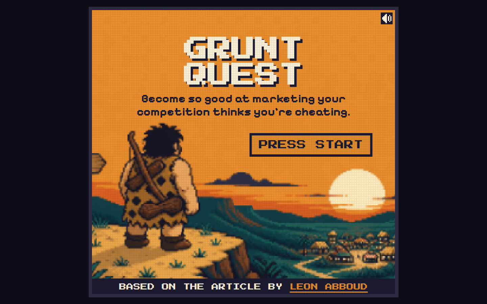

# THE BUYER

A seven minute pixel game about how people decide to buy. Eight stages, each one a mechanic that is one idea from Leon Abboud's article ["How to become so good at marketing your competition thinks you're cheating"](https://x.com/leonabboud/article/2094443253495894440). You talk to one buyer. If they have to decode a sentence, they leave.

Play it: https://the-buyer.vercel.app/

## Stages

1. The gap. A why ladder from "we need a better content strategy" down to the desire.
2. Three doors. Health, wealth, relationships. Sort products under a timer.
3. The filter. You are the brain. Pick the line that survives a 5,000 ad day.
4. Do they get it? Four questions. Jargon loses them.
5. The bridge. Pain, desire, distance. Five moves, some are traps.
6. The mechanism. Promise, claim or mechanism.
7. Positioning. Same service, two customers, two positions.
8. The vehicle. Last, on purpose.

## Running it

One file, no build step. Open `index.html` in a browser, or serve the folder with any static server.

Keyboard: number keys pick, arrows move a selection, Enter or Space confirms, arrows plus 1-8 on the map, `M` mutes. Touch and mouse work everywhere. Progress, tag, and best score save in the browser. After a clear, three letters put you on the board. Share includes `@emrreguney` and a beat link.

## How it was made

`PROMPT.md` has the prompt that built the first version, the critique of that prompt, the design method, and the critic log.

All the marketing lines in the game are from Leon Abboud's article. The game adds hearts and a buyer who either gets it or walks away.

To take this further, run the agent pack in `agents/README.md`.
